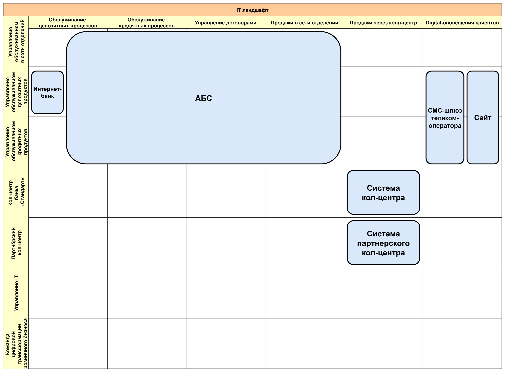
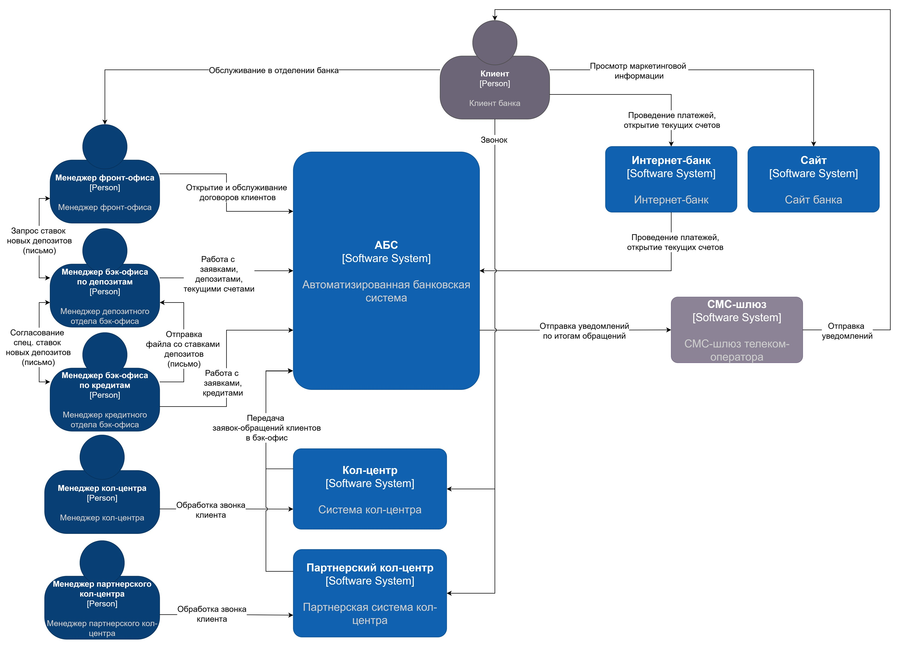

# Цифровая трансформация банка «Стандарт»
# Task1
## Текущий IT-ландшафт
[it-landscape.drawio](Task1/it-landscape.drawio)

## Текущая схема интеграции приложений
[integrations-scheme.drawio](Task1/integrations-scheme.drawio)

# Task2
## FURPS+ таблица
[FURPS+.md](Task2/FURPS+.md)
# Task3. Открытие депозитов онлайн
## Концептуальная архитектура открытия депозитов для MVP в формате ADR
[deposit-online-origination.md](Task3/deposit-online-origination.md)
## Диаграммы контекста и контейнеров в модели C4
[c4-context.drawio](Task3/c4-context.drawio)

## Диаграммы контекста и контейнеров в модели C4
[c4-container.drawio](Task3/c4-container.drawio)

