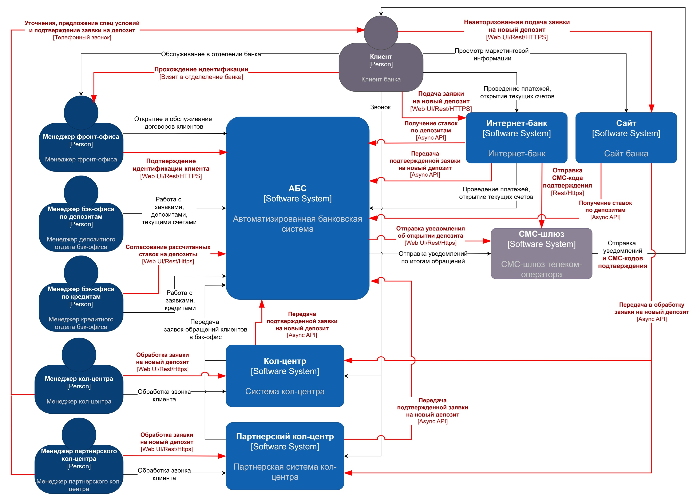
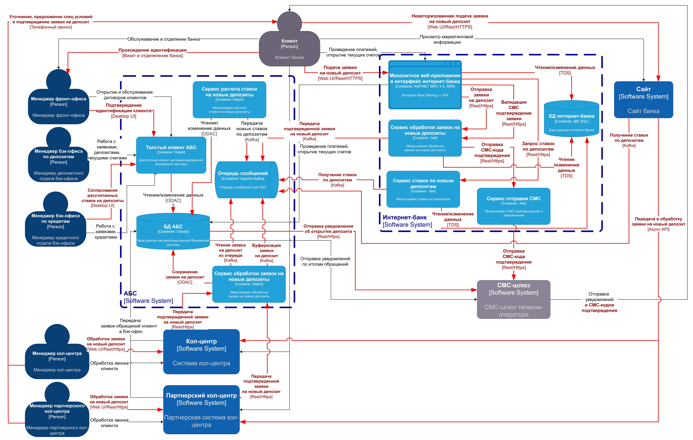

### **Название задачи:** Открытие депозитов онлайн для MVP
### **Автор:** Тесленко М.В.
### **Дата:** 2025.07.25
### **Функциональные требования**
Опишите здесь верхнеуровневые Use Cases. Их нужно оформить в виде таблицы с пошаговым описанием:

|**№**|**Действующие лица или системы**|**Use Case**|**Описание**|
| :-: | :- | :- | :- |
|UC1|Новый клиент, Сайт, Кол-центр, Оператор кол-центра, АБС, Менеджер фронт-офиса, Менеджер бэк-офиса, СМС-шлюз|Подача заявки на новый депозит через сайт|1. Новый клиент заходит на сайт и видит список доступных депозитов с актуальными общими ставками ->   2. Клиент выбирает продукт и заполняет форму заявки на сайте, указывая свой номер телефона и Ф.И.О. ->   3. Заявка передаётся в систему кол-центра ->   4. Оператор кол-центра (своего или партнерского) видит заявку в системе кол-центра и берет её в работу ->   5. Оператор кол-центра звонит клиенту, оставившему заявку, для подтверждения получения заявки, актуализации данных заявки в системе кол-центра, уточнения деталей и предложения особых условий ->   6. Система кол-центра передаёт актуальную заявку в АБС ->   7. Клиент приходит в отделение банка для идентификации. Менеджер фронт-офиса вносит соответствующую информацию в АБС ->   8. Менеджер бэк-офиса видит заявку клиента, прошедшего идентификацию, в АБС и берёт её в работу ->   9. После согласования условий нового депозита менеджером бэк-офиса, АБС инициирует отправку СМС-уведомления клиенту через СМС-шлюз ->   10. Клиент получает СМС-уведомление об открытии депозита |
|UC2|Существующий клиент, Интернет-банк, СМС-шлюз, АБС, Менеджер бэк-офиса|Подача заявки на новый депозит через интернет-банк|1. Существующий клиент заходит в интернет-банк и видит список доступных депозитов с актуальными общими и персонализированными ставками ->   2. В интернет-банке клиент выбирает продукт, выбирает текущий счет, сумму и подает заявку на открытие депозита ->   3. Интернет-банк через СМС-шлюз отправляет клиенту СМС-код для подтверждения операции ->   4. Клиент вводит в интернет-банке полученный СМС-код и подтверждает операцию открытия депозита ->   5. Подтвержденная заявка на депозит выгружается из интернет-банка в АБС ->   6. Менеджер бэк-офиса видит в АБС заявку клиента на новый депозит и берёт её в работу ->   7. После согласования условий нового депозита менеджером бэк-офиса, АБС инициирует отправку СМС-уведомления клиенту через СМС-шлюз ->   8. Клиент получает СМС-уведомление об открытии депозита |
|UC3|АБС, Менеджер бэк-офиса, Сайт, Интернет-банк, Системы кол-центра|Расчет и хранение ставок депозитов|1. В начале банковского дня АБС (или новый сервис) рассчитывает новые ставки депозитов ->   2. Менеджер бэк-офиса в АБС видит новые рассчитанные ставки, валидирует их и подтверждает к использованию для новых депозитов ->   3. АБС передает новые ставки в сервисы Сайта, Интернет-банка и Системы кол-центра (прямой интеграцией или через выгрузку в файл) |
### **Нефункциональные требования**
Опишите здесь нефункциональные требования и архитектурно значимые требования.

|**№**|**Требование**|
| :-: | :- |
|R1|Режим работы всех сервисов 24/7|
|R2|Доступность сервисов составляет 99,9%|
|P1|Время отклика < 1 сек для всех операций|
|P2|Горизонтальное масштабирование и балансировка нагрузки для новых сервисов интернет-банка и сайта|
|P3|Кэширование часто используемых данных (справочники, актуальные ставки, продуктовый каталог)|
|S2|Минимизация доработок функционала работы с СМС в ядре системы Интернет-банка|
|+R1|Шифрование клиентских данных при передаче с сайта и интернет-банка и хранении|
|+R2|Использование технологий и платформ, которые уже используются, или по которым в банке уже имеется экспертиза - СУБД: Oracle, MS SQL; Код: Delphi, PHP, React.js, Java, .Net, SQL|
|+R3|Минимизация нагрузки на АБС (кеширование, постоянный аудит запросов, асинхронная обработка заданий через Jobs/AQ/файлы)|
|+R4|В качестве очереди сообщений необходимо использовать Kafka (в интернет-банке сейчас недоступно)|
### **Решение**
Приведите диаграммы контекста и контейнеров в модели C4. Опишите там основные компоненты и интеграции всех элементов решения. 
#### Диаграмма контекста в модели C4
[c4-context.drawio](c4-context.drawio)

1. Так как АБС уже работает на пределе возможностей, для минимизации отклика при проведении операций открытия депозитов, а также сокращения простоя бизнес-сервисов при проведении регламентных работ в АБС, для взаимодействия интернет-банка и сайта с АБС требуется реализовать асинхронное взаимодействие через брокера сообщений.

2. Также для отправки СМС-кодов подтверждения операций требуется реализовать прямую интеграцию с СМС-шлюзом телеком-оператора, чтобы избежать доработок в ядре АБС.

3. Потребуются новые интеграции между сайтом, кол-центром и АБС. Требуется проанализировать и запланировать с подрядчиком аналогичные доработки в системе партнерского кол-центра, а также согласовать с инфобезами требования к интеграции из партнерского КЦ в АБС для передачи заявок.

#### Диаграмма контейнеров в модели C4
[c4-container.drawio](c4-container.drawio)

1. Серверную часть новой функциональности интернет-банка реализовать в виде трёх отдельно размещенных сервисах Обработки заявок, Расчета ставок по депозитам и Отправки СМС. В сервисе расчета ставок реализовать кэширование актуальных ставок депозитов. По возможности доработать кэширование данных в монолите Интернет-Банка [требования P3, S2]
2. Для обеспечения отказоустойчивости и высокой доступности новые сервисы интернет-банка, сайта и АБС развернуть под управлением Kubernetes с возможностью динамического горизонтального масштабирования и резервирования с использованием дополнительного ЦОДа. Брокера сообщений Kafka также развёрнуть в виде кластер из нечетного количества узлов узлов  [требования R1, R2, P1, P2]
3. Для защиты клиентских данных как при передаче между IT-системами, так и при взаимодействии с пользователями использовать шифрование на уровне приложений и, при возможности, канальное шифрование: HTTPS, TLS, VPN [требования +R1] 
4. Для разработки новых сервисов использовать технологии, близкие соответствующей команде разработки: АБС - Delphi, Интернет-банк - .Net. Для хранения данных переиспользовать развернутые инстансы БД: АБС - Oracle, Интернет-банк - MS SQL [требования +R2]
5. Для снижения нагрузки на АБС и повышения доступности бизнес-сервисов в целом реализовать в новых сервисах асинхронный способ взаимодействия с АБС. Для асинхронного взаимодействия развернуть брокер сообщений Kafka [требования R1, R2, +R3, +R4].
6. Система Интернет-банк взаимодействует с Kafka через промежуточные сервисы команды Интернет-банка, т.к. не имеет возможностей подобных интеграций [требования +R4]
7. Системы Кол-центра и Партнерского кол-центра взаимодействуют через промежуточные сервисы команды АБС, т.к. отсутствует возможность (небезопасно) предоставлять доступ в брокер сообщений Kafka из внешней сети (партнерский КЦ), а также хочется реализовать единую точку получения заявок из всех КЦ. Прямой доступ в АБС мимо очереди может привести к скачкам нагрузки на АБС и задержкам обработки заявок из других каналов, если КЦ будет выгружать их большими пачками, а на стороне БД не будет реализована дополнительная логика "омниканальности", что не хотелось бы.

### **Альтернативы**
#### 1. Не выносить отправку СМС-подтверждений операций в отдельный сервис команды Интернет-банка, а переиспользовать функциальность ядра

| **Критерий**        | **Описание**                                                      |
| ------------------- | ----------------------------------------------------------------- |
| **Плюсы**    | - Меньше разрабатывать  - Использование существующей инфраструктуры|
| **Минусы**      | - Увеличение зависимости от вендорского решения - Требует доработки ядра Интернет-банка, что может привнести проблемы сопровождаемости в будущем (например, при обновлении на следующие стандартные версии от подрядчика) - Риск поломать другую функциональность Интернет-Банка, не учтенную при тестировании |
| **Причина отказа** | Желание развивать микросервисность Интернет-банка в будущем - не потребуется тотально переписывать часть депозитов + получение экспертизы |

#### 2. Не использовать Kubernetes для новых сервисов Интернет-банка, Сайта и АБС, подняв по паре инстансов в режиме active-active или active-standby для горизонтального масштабирования
| **Критерий**        | **Описание**                                                      |
| ------------------- | ----------------------------------------------------------------- |
| **Плюсы**    | - – Не требуется экспертиза в Kubernetes  - Проще реализовать|
| **Минусы**      | - Не подходит для динамически изменяющейся нагрузки - Риск промахнуться с ожидаемой пиковой нагрузкой в принципе, что повлечет проблемы с поиском ресурсов и их дальнейшим простоем в обычном режиме |
| **Причина отказа** | В любом случае требуется балансировка и увеличение количества инстансов сервисов при дальнейшем развитии бизнеса. Экономия трудозатрат сейчас выглядит нецелесообразной, особенно с т.зр. движения в сторону микросервисной архитектуры и необходимости наращивания соответствующей экспертизы |

#### 3. Реализовать функционал расчета и отдачи ставок депозитов целиком в АБС без выноса в отдельный сервис
| **Критерий**        | **Описание**                                                      |
| ------------------- | ----------------------------------------------------------------- |
| **Плюсы**    | - Проще реализовать на PL/SQL рядом со всеми имеющимися данными  - Потребуется меньше ресурсов на хранение данных, т.к. данные по ставкам будут только в АБС - Меньше риск искажения критичных данных, т.к. после подтверждения бэк-офисом данные не передаюся в целевые системы через несколько слоёв интеграции|
| **Минусы**      | - АБС перегружена, доп. нагрузка по CPU может остановить обслуживанием или приводить к конкуренции - В случае недоступности АБС во время работ или сбоев работа бизнес-сервисов Интернет-банка может быть заблокирована отсутствием ставок в их кэше (например, из-за внеплановой перезагрузки) - Без внешнего сервиса из БД Oracle сложнее реализовать не примитивную интеграцию с Kafka - Сложность быстрого обновления бизнес-логики в БД в случае критической ошибки |
| **Причина отказа** | Высокие требования к надежности, текущая нагрузка на АБС и необходимость иметь возможность быстро-фиксов в критичной логике определания ставки депозитов (иначе клиентский негатив, репутационные издержки и привлечение внимания регулаторов) |

#### 3. Реализовать передачу заявок на депозиты из Кол-центров и Интернет-банка в АБС через файлообмен (SFTP)
| **Критерий**        | **Описание**                                                      |
| ------------------- | ----------------------------------------------------------------- |
| **Плюсы**    | - Проще реализовать  - Не потребуется Kafka|
| **Минусы**      | - Больше временные задержки на формирование пачки выгрузки  - Меньше контроля за ручным вмешательством в данные   - Сложнее мониторинг работоспособности механизма (файлы частично(!) могут быть залочены антивирусом) - Отсутствие простого резервирования канала передачи  - Необходимость учета в разработке большего числа сценариев ошибок при многопоточном и интенсивном обмене информацией |
| **Причина отказа** | Топорный механизм, ограниченный по производительности и средствам мониторинг, к которому можно будет вернуться в случае сложностей с согласованием  с инфобезами доступов для партнерского КЦ |

### Недостатки, ограничения и риски выбранного решения.

#### Недостатки
1. Необходима экспертиза в Kubernetes и Kafka
2. Необходимы дополнительные ресурсы для разворачивания кластеров Kubernetes и Kafka
3. Часть сервисов внедряется с расчетом на дальнейшее микросервисное развитие - перерасход ресурсов, в моменте неоправданный для текущих задач с т.зр. бизнеса
#### Ограничения
1. Основной функционал интернет-банка в монолитном приложении. Для перевода в микросервисную арх-ру нужен отдельный проект, не связанный с MVP в сжатые сроки
2. АБС - узкое место, предполагающее только вертикальное масштабирование. Это ограничение на дальнейший рост бизнеса и высокие затраты на инфраструктуру.
3. Зависимость от подрядчика системы Интернет-Банка - выше стоимость развития и сопровождения, ограниченность вмешательства в ядро собственной команды (проблемы при дальнейших обновлениях)
4. Интерфейсы АБС менеджеров бэк-офиса депозитов и кредитов должны быть разделены и не иметь доступ к данным друг друга по требованиям безопасности
#### Риски
1. Безопасность не согласует доступ партнерского КЦ к сервису команды АБС для передачи заявок на депозиты. Может потребоваться дублирование сервиса в отдельной зоне или использование другой схемы интеграции
2. АБС не выдержит нагрузки (отказы в обслуживании или слишком долгие ответы). Частично митигируем асинхронным взаимодействием и постоянным аудитом нагрузки - как минимум проблемы будут не по вине MVP депозитов :-) Возможно стоить подготовить более мощное железо для БД, если доступно.
3. Монолитная архитектура интернет-банка от подрядчика может не выдержать нагрузки и привносит сложности дальнейшего развития. Требуется планировать отдельным проектом переход на микросервисную архитектуру