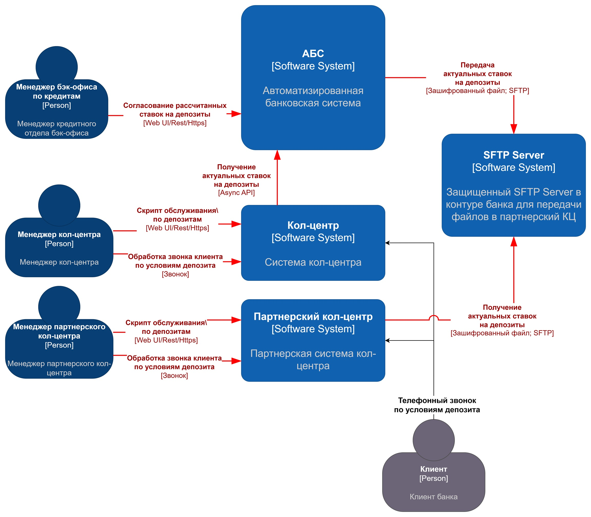
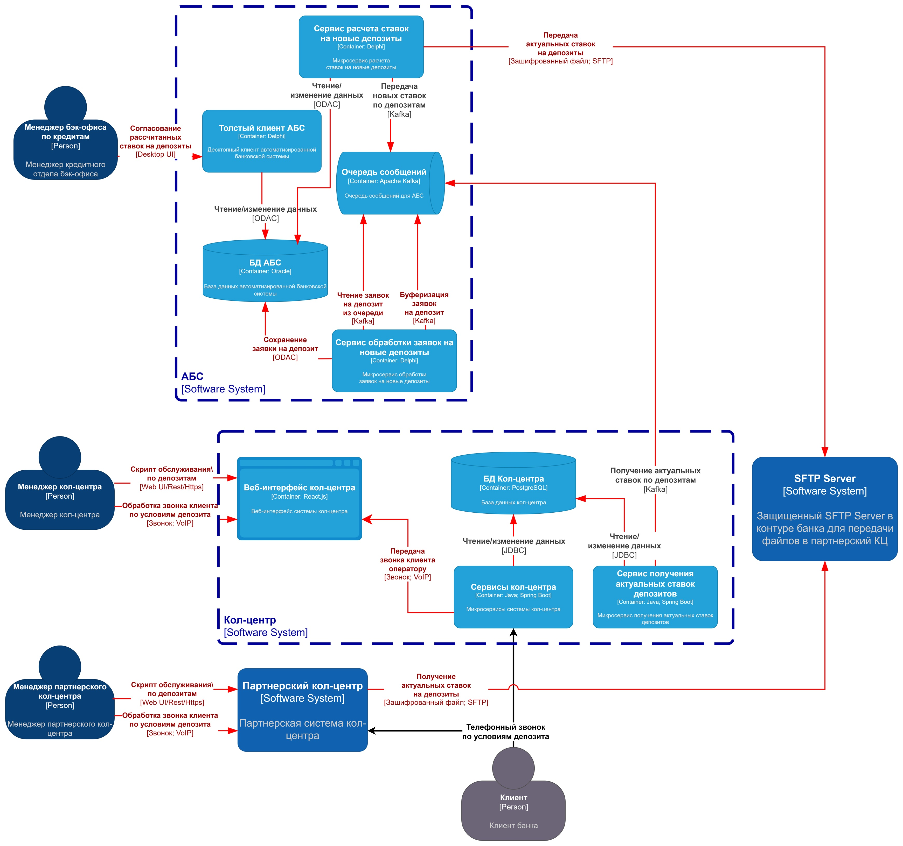

### **Название задачи:** Передача ставок депозитов в системы Кол-Центра
### **Автор:** Тесленко М.В.
### **Дата:** 2025.07.26
### **Функциональные требования**
Опишите здесь верхнеуровневые Use Cases. Их нужно оформить в виде таблицы с пошаговым описанием:

|**№**|**Действующие лица или системы**|**Use Case**|**Описание**|
| :-: | :- | :- | :- |
|UC1|Менеджер бэк-офиса, АБС, кол-центр, оператор кол-центра|Передача ставок депозитов в систему Кол-Центра|1. Менеджер бэк-офиса по кредитам утверждает в интерфейсе АБС новые ставки депозитов, рассчитанные сервисом АБС ->   2. Сервис АБС публикует новые ставки в очередь брокера сообщений ->   3. Система кол-центра вычитывает новые ставки депозитов из очереди и сохраняет их у себя, делая доступными в интерфейсе операторов Кол-центра |
|UC2|Менеджер бэк-офиса, АБС, сервер SFTP, партнерский кол-центр, оператор партнерского кол-центра|Подача заявки на новый депозит через интернет-банк|1. Менеджер бэк-офиса по кредитам утверждает в интерфейсе АБС новые ставки депозитов, рассчитанные сервисом АБС ->   2. Сервис АБС публикует новые ставки в очередь брокера сообщений ->   3. Сервис АБС вычитывает новые ставки на депозиты и выкладывает их в виде файлов на сервер SFTP -> 4. Система партнерского кол-центра вычитывает файл новых ставок депозитов с сервера SFTP, разбирает и сохраняет ставки у себя, делая их доступными в интерфейсе операторов партнерского Кол-центра |
|UC3|Клиент, Оператор (партнерского) кол-центра, Система (партнерского) кол-центра|Отображение актуальных ставок депозитов в системе (партнерского) кол-центра|1. Клиент звонит в (партнерский) кол-центр уточнить условия по депозиту ->   2. Оператор кол-центра принимает звонок в обработку и запускает скрипт по обслуживанию депозита ->   3. Интерфейс системы (партнерского) кол-центра дает возможность отобразить актуальные ставки депозитов, которые оператор (партнерского) кол-центра может озвучить клиенту |
### **Нефункциональные требования**
Опишите здесь нефункциональные требования и архитектурно значимые требования.

|**№**|**Требование**|
| :-: | :- |
|R1|Режим работы сервисов прогрузки ставок депозитов 24/7 (могут поменяться в любой момент)|
|R2|Время простоя сервисов прогрузки ставок депозитов в КЦ не более 10 минут|
|P1|Ставки должны прогружать в системы КЦ и партнерского КЦ не более, чем за 15 минут|
|S1|Должна быть возможность указать несколько строк подключения SFTP для резервирования канала передачи с партнерским кол-центром|
|+R1|Необходимо обеспечить шифрование данных при передаче между системами|
|+R2|Использование технологий и платформ, которые уже используются, или по которым в банке уже имеется экспертиза - СУБД: Oracle, MS SQL; Код: Delphi, PHP, React.js, Java, .Net, SQL|
|+R3|Минимизация нагрузки на АБС (кеширование, постоянный аудит запросов, асинхронная обработка заданий через Jobs/AQ/файлы)|
|+R4|В качестве очереди сообщений необходимо использовать Kafka (в интернет-банке сейчас недоступно)|
|+R5|Передача данных в партнёрский кол-центр должна осуществляться по защищенному SFTP протоколу. Возможность API-вызовов отсутствует|
### **Решение**
Приведите диаграммы контекста и контейнеров в модели C4. Опишите там основные компоненты и интеграции всех элементов решения. 
#### Диаграмма контекста в модели C4
## Диаграмма контекста в модели C4
[c4-context.drawio](c4-context.drawio)

1. Так как АБС уже работает на пределе возможностей, для минимизации нагрузки система кол-центра банка будет получать ставки асинхронно из той же очереди, что и системы Интернет-банка и Сайта.

2. Так как система партнерского кол-центра не поддерживает вызовы API, но готова к обмену файлами, требуется настроить основной SFTP Server, через который будет осуществлять обмен файлам, и резервный SFTP Server, на случай недоступности основного.

#### Диаграмма контейнеров в модели C4
[c4-container.drawio](c4-container.drawio)

1. Для обеспечения отказоустойчивости и высокой доступности новый сервис Кол-центра для получения ставок депозитов из Kafka разместить по аналогии с остальными сервисами Кол-центра с возможностью динамического горизонтального масштабирования и резервирования [требования R1, R2, P1]
2. Для разработки нового сервиса Кол-центра использовать технологии, близкие соответствующей команде разработки: Java. Для хранения данных переиспользовать развернутый инстанс БД: PostgreSQL [требования +R2]
3. Для защиты клиентских данных как при передаче между IT-системами, так и при взаимодействии с пользователями использовать шифрование на уровне приложений и, при возможности, канальное шифрование: HTTPS, TLS, SFTP, VPN [требования +R1, +R5] 
4. Для снижения нагрузки на АБС и повышения доступности бизнес-сервисов в целом реализовать получение ставок депозитов для системы Кол-центра из брокера сообщений Kafka [требования +R3, +R4].
5. Генерация файла со ставками депозитов для выгрузки в партнерский кол-центр через SFTP осуществляет микросервис в рамках того же сервиса, который расчитывает эти ставки. Не потребуется участие АБС [требования +R3, +R4]
6. В случае, если основной сервер SFTP недоступен, сервис АБС пишет файл на резервный SFTP. Система партнерского кол-центра вычитывает файл со ставками с обоих серверов (где найдет) [требования R1, R2, P1, S1]

### **Альтернативы**
#### 1. Единое API для передачи ставок из Kafka

| **Критерий**        | **Описание**                                                      |
| ------------------- | ----------------------------------------------------------------- |
| **Плюсы**    | - Меньше разрабатывать  - Проще сопровождение единой точки интеграции  - Быстрее доставка до партнерского кол-центра|
| **Минусы**      | - Требуется доработка в системе партнерского кол-центра - Более высокие требования к безопасности, необходимость согласование |
| **Причина отказа** | Партнер не готов дорабатывать систему для поддержки вызовов внешнего API |

### Недостатки, ограничения и риски выбранного решения.

#### Недостатки
1. Задержка на передачу ставок в партнерский кол-центр, т.к. требуется доп время на формирование и загрузку файла, а затем на его "обнаружение" и заливку в систему партнерского кол-центра. Оба действия осуществляются с определённым интервалом
2. Сложность мониторинга передачи файлов через SFTP. Например, часть файлов может быть заблокирована антивирусом при успешной обработке остальных
3. Необходимость поддерживать и развивать два способа передачи ставок в кол-центры
#### Ограничения
1. Из-за асинхронности передачи ставки в кол-центрах могут быть какое-то время неактуальными.
2. Работы на сервисах передачи ставок не должны приводить к простоям более 10 минут, т.к. это приведет к неправильным консультациям клиентов и, как следствие, репутационным издержкам
#### Риски
1. Дополнительное звено в виде SFTP сервера, которое может отказать